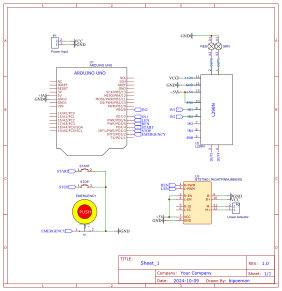

## อธิบายวงจร

### 1. **Arduino UNO (U1)**:
   - เป็นไมโครคอนโทรลเลอร์หลักในการควบคุมวงจรนี้ มีการเชื่อมต่อกับปุ่มต่าง ๆ ได้แก่:
     - **START** (เชื่อมต่อกับขา 5)
     - **STOP** (เชื่อมต่อกับขา 4)
     - **EMERGENCY** (เชื่อมต่อกับขา 3)

   - Arduino ยังเชื่อมต่อกับ **มอเตอร์ไดร์เวอร์ L298N (U2)** ผ่านขา PWM:
     - **IN1, IN2** สำหรับควบคุมทิศทางของมอเตอร์
     - **EN1, EN2** สำหรับการเปิดใช้งานมอเตอร์

### 2. **ปุ่มควบคุม (START, STOP, EMERGENCY)**:
   - มีปุ่มควบคุม 3 ปุ่มเพื่อเริ่ม หยุด และปิดการทำงานฉุกเฉิน โดยปุ่มฉุกเฉิน (Emergency) เป็นปุ่มกดสีแดงขนาดใหญ่ที่เชื่อมต่อโดยตรงกับ GND เพื่อทำงานเป็นปุ่มตัดระบบในกรณีฉุกเฉิน.
   
### 3. **มอเตอร์ไดร์เวอร์ L298N (U2)**:
   - เป็นตัวขับมอเตอร์ที่เชื่อมต่อกับ Arduino ผ่านขา **IN1, IN2, EN1, EN2**. วงจรนี้ใช้ L298N ในการขับเคลื่อนมอเตอร์ไฟฟ้าหรือตัวขับเคลื่อนเชิงเส้นเพื่อการเคลื่อนไหว เช่น เลื่อนหรือขยายส่วนประกอบทางกลไก.

### 4. **วงจรไฟ LED**:
   - มีการเชื่อมต่อกับ LED สีแดงและสีเขียวเพื่อติดตามสถานะของระบบ:
     - **สีแดง** อาจบ่งบอกถึงสถานะฉุกเฉินหรือหยุดทำงาน.
     - **สีเขียว** อาจบ่งบอกถึงการทำงานปกติของระบบ.

### 5. **ตัวขับเคลื่อนเชิงเส้น (Linear Actuator) ที่ควบคุมด้วย BTS7960 (U3)**:
   - เป็นตัวควบคุมการทำงานของตัวขับเคลื่อนเชิงเส้น ซึ่งมักจะใช้ในระบบที่ต้องการเคลื่อนย้ายสิ่งของหรือส่วนประกอบเชิงกลไก. BTS7960 จะควบคุมการทำงานของตัวขับเคลื่อนให้เคลื่อนที่ตามการสั่งการจาก Arduino ผ่านสัญญาณ PWM และควบคุมการเลื่อนออกหรือเข้า.

### 6. **แหล่งจ่ายไฟ (Power Input)**:
   - ระบบมีแหล่งจ่ายไฟที่จ่ายให้กับ Arduino ผ่านขั้ว VCC และ GND.

## อธิบาย Code

### 1. **การกำหนดค่า Pin**:
   ```cpp
   const int REN = 5;
   const int LEN = 6;
   const int EMERGENCY_BTN = 2;
   const int STOP_BTN = 3;
   const int START_BTN = 4;
   const int LAMP_RED = 7;
   const int LAMP_GRN = 8;
   ```
   - กำหนดหมายเลข **Pin** สำหรับการควบคุมตัวขับเคลื่อนเชิงเส้นและปุ่มต่าง ๆ.
     - **REN (Pin 5)**: ควบคุมการขับเคลื่อนเชิงเส้นในทิศทางหนึ่ง (ไปข้างหน้า).
     - **LEN (Pin 6)**: ควบคุมการขับเคลื่อนเชิงเส้นในทิศทางตรงกันข้าม (ถอยหลัง).
     - **EMERGENCY_BTN (Pin 2)**: ปุ่มฉุกเฉิน.
     - **STOP_BTN (Pin 3)**: ปุ่มหยุด.
     - **START_BTN (Pin 4)**: ปุ่มเริ่ม.
     - **LAMP_RED (Pin 7)**: หลอดไฟ LED สีแดง (แสดงสถานะฉุกเฉิน).
     - **LAMP_GRN (Pin 8)**: หลอดไฟ LED สีเขียว (แสดงสถานะการทำงานปกติ).

### 2. **การตั้งค่าการทำงานใน `setup()`**:
   ```cpp
   void setup() {
     Serial.begin(115200);
     pinMode(REN, OUTPUT);
     pinMode(LEN, OUTPUT);
     pinMode(LAMP_GRN, OUTPUT);
     pinMode(LAMP_RED, OUTPUT);
     pinMode(START_BTN, INPUT_PULLUP);
     pinMode(EMERGENCY_BTN, INPUT_PULLUP);
     pinMode(STOP_BTN, INPUT_PULLUP);
     attachInterrupt(digitalPinToInterrupt(EMERGENCY_BTN), onEmergency, RISING);
     pullActuator();
     emergencyState = !emergencyBtn();
   }
   ```
   - ตั้งค่าการทำงานของ Pin ต่าง ๆ เช่นกำหนดให้เป็น **OUTPUT** หรือ **INPUT**.
   - ใช้ฟังก์ชัน **attachInterrupt** เพื่อเรียกฟังก์ชัน **onEmergency()** เมื่อปุ่มฉุกเฉินถูกกด.
   - ตั้งค่าให้ตัวขับเคลื่อนเชิงเส้นเริ่มต้นด้วยการ "ถอยหลัง" (**pullActuator()**).
   - กำหนดสถานะเริ่มต้นของ **emergencyState** โดยตรวจสอบว่าปุ่มฉุกเฉินถูกกดหรือไม่.

### 3. **ลูปหลัก `loop()`**:
   ```cpp
   void loop() {
     Serial.println(emergencyState);
     digitalWrite(LAMP_GRN, !emergencyState);
     digitalWrite(LAMP_RED, emergencyState);
     if (!emergencyState) {
       nStart = readStartBtn();
       if (nStart != lStart) {
         if (!nStart) {
           pushActuator();
           delay(100);
         }
         lStart = nStart;
       }

       nStop = readStopBtn();
       if (nStop != lStop) {
         if (!nStop) {
           pullActuator();
           delay(100);
         }
         lStop = nStop;
       }
     }
     else {
       emergencyState = !emergencyBtn();
     }
   }
   ```
   - ในลูปหลัก:
     - แสดงสถานะฉุกเฉิน (**emergencyState**) ใน Serial Monitor.
     - เปิดหรือปิดหลอดไฟ LED สีเขียวและสีแดงขึ้นอยู่กับสถานะฉุกเฉิน:
       - LED สีเขียวเปิดเมื่อระบบทำงานปกติ (ไม่มีสถานะฉุกเฉิน).
       - LED สีแดงเปิดเมื่อระบบอยู่ในสถานะฉุกเฉิน.
     - ตรวจสอบสถานะของปุ่ม **START** และ **STOP**:
       - ถ้าปุ่ม **START** ถูกกด ระบบจะสั่งให้ตัวขับเคลื่อนเชิงเส้นเคลื่อนที่ไปข้างหน้า (**pushActuator()**).
       - ถ้าปุ่ม **STOP** ถูกกด ระบบจะสั่งให้ตัวขับเคลื่อนเชิงเส้นเคลื่อนที่ถอยหลัง (**pullActuator()**).

### 4. **ฟังก์ชัน `onEmergency()`**:
   ```cpp
   void onEmergency() {
     emergencyState = true;
     stopActuator();
   }
   ```
   - ฟังก์ชันนี้จะถูกเรียกเมื่อมีการกดปุ่มฉุกเฉิน. จะเปลี่ยนสถานะ **emergencyState** เป็น `true` และสั่งให้ตัวขับเคลื่อนเชิงเส้นหยุดทำงานทันที (**stopActuator()**).

### 5. **ฟังก์ชันสำหรับอ่านปุ่ม**:
   ```cpp
   int readStartBtn() {
     return digitalRead(START_BTN);
   }
   int readStopBtn() {
     return !digitalRead(STOP_BTN);
   }
   int emergencyBtn() {
     return !digitalRead(EMERGENCY_BTN);
   }
   ```
   - อ่านสถานะของปุ่มเริ่ม, หยุด และปุ่มฉุกเฉิน:
     - ฟังก์ชัน **readStartBtn()** อ่านค่าสถานะของปุ่มเริ่ม.
     - ฟังก์ชัน **readStopBtn()** อ่านค่าสถานะของปุ่มหยุด.
     - ฟังก์ชัน **emergencyBtn()** อ่านค่าสถานะของปุ่มฉุกเฉิน (ค่า `1` หมายถึงปุ่มถูกกด).

### 6. **ฟังก์ชันควบคุมตัวขับเคลื่อนเชิงเส้น**:
   ```cpp
   void pushActuator() {
     digitalWrite(REN, HIGH);
     digitalWrite(LEN, LOW);
   }
   void pullActuator() {
     digitalWrite(LEN, HIGH);
     digitalWrite(REN, LOW);
   }
   void stopActuator() {
     digitalWrite(LEN, LOW);
     digitalWrite(REN, LOW);
   }
   ```
   - ฟังก์ชันเหล่านี้ควบคุมการทำงานของตัวขับเคลื่อนเชิงเส้น:
     - **pushActuator()**: สั่งให้ตัวขับเคลื่อนเคลื่อนที่ไปข้างหน้า.
     - **pullActuator()**: สั่งให้ตัวขับเคลื่อนถอยหลัง.
     - **stopActuator()**: สั่งให้ตัวขับเคลื่อนหยุดทำงาน.

### สรุป:
โค้ดนี้เป็นระบบควบคุมตัวขับเคลื่อนเชิงเส้นที่สามารถสั่งให้เคลื่อนที่ไปข้างหน้า ถอยหลัง หรือหยุด โดยใช้ปุ่มควบคุม (START, STOP, และ EMERGENCY) และมีหลอดไฟ LED เพื่อแสดงสถานะของระบบ.